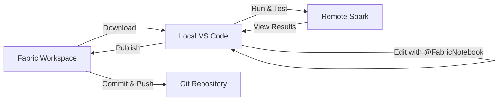

# Phase 2 · Notebook Development

**Goal:** fill in the three empty notebooks scaffolded in [Phase 1](01-initial-architecture-setup.md) — `01_bronze_ingest`, `02_silver_transform`, `03_gold_star_schema` — using the **Fabric Data Engineering VS Code extension** and the **FabricNotebook** custom agent in GitHub Copilot Chat.

> Grounded in [Section 2 — Develop Fabric Notebooks in VS Code](../docs/02-fabric-notebooks-vscode.md).

---

## Prerequisites

- The [**Fabric Data Engineering VS Code extension**](https://marketplace.visualstudio.com/items?itemName=SynapseVSCode.synapse), signed in to your workspace.
- The three empty notebooks from Phase 1 and the raw CSVs staged in `aw_bronze` under `Files/raw/`.

---

## Choose your editing mode: Local vs VFS

The extension offers two ways to edit notebooks ([source](https://learn.microsoft.com/fabric/data-engineering/setup-vs-code-extension#choose-a-workspace)). Pick the one that fits your workflow.

| | **Local mode** | **VFS mode** |
|---|---------------|--------------|
| Where files live | Downloaded to a local folder, synced back | Edited in place as remote files |
| Multiple workspaces at once | One at a time | Multiple in one window |
| Best for | Offline editing, **Git-based workflows** | Quick cross-workspace edits |

**This demo uses Local mode** — it's the best fit for Git-based workflows and provides full GitHub Copilot integration.

→ Full details: [2.2 Local mode vs. VFS mode](../docs/02-fabric-notebooks-vscode.md#22-local-mode-vs-vfs-mode).

---

## Working in Local Mode: Complete Workflow

### Step 1: Configure Local Work Folder

Before downloading any notebooks, set up where the extension will store your local copies.

1. Open the **Command Palette** (`Ctrl+Shift+P` / `Cmd+Shift+P`)
2. Run: **`Fabric Data Engineering: Set Local Work Folder`**
3. Choose or create a folder (e.g., `C:\dev\FabricLocal` or `~/dev/FabricLocal`)

This folder will contain subfolders organized by **Workspace ID** → **Artifact Type** → **Artifact ID** → **Artifact Name**.

### Step 2: Connect to Your Fabric Workspace

1. Click the **Fabric Data Engineering** icon in the Activity Bar (left sidebar)
2. Click **Select Workspace** at the top of the Fabric view
3. Sign in if prompted, then choose your workspace from the list
4. The extension will display all artifacts in your workspace (Notebooks, Lakehouses, Environments, etc.)

### Step 3: Download a Notebook

Download notebooks from Fabric to your local folder for editing:

1. In the **Fabric Data Engineering** view, expand your workspace
2. Expand the **SynapseNotebook** section to see all notebooks
3. Right-click on the notebook you want to edit (e.g., `01_bronze_ingest`)
4. Select **Download**

The extension will:
- Download the notebook to your local work folder
- Create the folder structure: `{WorkspaceId}/SynapseNotebook/{ArtifactId}/{NotebookName}/`
- Add the `.ipynb` file and a `builtin/` folder for notebook resources

### Step 4: Open the Notebook in VS Code

1. After downloading, right-click the notebook in the Fabric view again
2. Select **Add to Workspace**
3. Choose:
   - **Add to Current Workspace** (if you have a workspace open)
   - **Open in New Window** (to work in a dedicated window)

The notebook folder will appear in your VS Code Explorer, and the `.ipynb` file will open in the notebook editor.

### Step 5: Configure the Fabric Runtime Kernel

To run notebook cells against your Fabric Spark environment, you need to select the correct kernel:

1. With the notebook open, look at the **kernel selector** in the top-right corner
2. Click the kernel name (it may say "Select Kernel" or show a different kernel)
3. Choose **Microsoft Fabric Runtime** from the list
4. Select the language variant:
   - **PySpark** for Python-based Spark notebooks (most common)
   - **Python** for pure Python (no Spark context)
   - **Scala** for Scala-based Spark code
   - **SparkR** for R-based Spark code
   - **SQL** for Spark SQL notebooks

**For this demo, select: `Microsoft Fabric Runtime - PySpark`**

This kernel connects to your **remote Fabric workspace** Spark environment — no local Spark installation needed.

### Step 6: Develop with GitHub Copilot

Now you're ready to use the **FabricNotebook** custom agent to author code:

1. Open **GitHub Copilot Chat** (icon in the Activity Bar, or `Ctrl+Shift+I`)
2. In the chat panel, configure:
   - **Session type**: Select **Local** (the FabricNotebook agent requires Local mode)
   - **Agent selector**: Choose **@FabricNotebook**
3. Send prompts describing what you want the notebook to do

**Example prompt (for `01_bronze_ingest`):**

```text
In this notebook, ingest the tab-separated CSVs from Files/raw/ in the default
lakehouse into Bronze Delta tables. For each of Sales, Targets, Product, Reseller,
Salesperson, Region, and SalespersonRegion, read with sep="\t", header=true, and
inferSchema=false (keep everything as strings at Bronze). Write each to a Delta
table named bronze_<name> (overwrite). Add an ingestion timestamp column
_ingested_at. Show the row count for each table when done.
```

**What the agent will do:**
- Generate code cells using Fabric-specific APIs (`notebookutils`, PySpark on the built-in `spark` session)
- Insert cells directly into your open notebook
- Ask for confirmation before running the cells
- Use the correct paths for your lakehouses (relative paths for default lakehouse, ABFSS paths for others)

### Step 7: Test and Run Cells Locally

Once the agent inserts code cells, test them against your remote Fabric environment:

1. **Review the generated code** in each cell
2. Click the **▶ Run** button next to a cell, or press `Shift+Enter`
3. The cell executes on **remote Fabric Spark** (not a local engine)
4. View outputs directly below each cell:
   - DataFrames render as tables
   - Errors show full stack traces
   - Print statements and display() outputs appear inline

**If errors occur:**
- Share the error with the **@FabricNotebook** agent: "Fix the error in Cell 3"
- The agent will read the cell output, diagnose the issue, and suggest a corrected version
- Confirm the fix, and the agent will update the cell

**Common debugging workflow:**
```text
@FabricNotebook the cell failed with "FileNotFoundError". Check if the path is correct.
```

The agent will inspect the notebook context and outputs, then propose a fix.

### Step 8: Iterate Until Complete

Continue this cycle:
1. **Prompt** the agent with next steps or refinements
2. **Review and run** the generated code
3. **Debug and fix** any issues with the agent's help
4. Move on to the next notebook when satisfied

**Tip:** The agent maintains awareness of:
- Your workspace ID and lakehouse connections
- Previously generated code in the notebook
- Available custom libraries in your Environment artifact
- Existing data in your lakehouses (via discovery tools)

### Step 9: Publish the Notebook Back to Fabric

When your notebook is working correctly, publish it back to the Fabric workspace:

1. **Save your notebook** (`Ctrl+S` / `Cmd+S`)
2. In the **Fabric Data Engineering** view, find your notebook
3. Right-click the notebook and select **Publish**

**Before publishing, the extension will:**
- **Compare local and remote versions** to detect conflicts
- If both versions have changed, it will **merge changes automatically** (or prompt you to resolve conflicts)
- Publish the merged version to Fabric

**After publishing:**
- The remote notebook in Fabric is updated with your changes
- The `M` (modified) marker disappears from the Fabric view
- Your notebook is ready to run in the Fabric workspace

**Important:** Publishing only updates the notebook in Fabric — it does **not** commit to Git or create a version in Fabric's built-in source control.

### Step 10: Commit Changes in the Fabric Portal

To version your work in Fabric's Git integration:

1. Open your **Fabric workspace** in a browser
2. Navigate to **Workspace Settings** → **Git integration**
3. You'll see uncommitted changes (including your updated notebook)
4. Click **Source control** to view the changes
5. Review the diff, add a commit message, and **Commit** the changes
6. **Push** your commits to the remote Git repository (e.g., Azure DevOps, GitHub)

This creates a proper version history in your Git repository and keeps the Fabric workspace in sync with your repo.

---

### Local Mode + Git Workflow Summary



**Key advantages:**
- ✅ Work offline with full Git integration
- ✅ Use GitHub Copilot's FabricNotebook agent for intelligent code generation
- ✅ Test on remote Fabric Spark (no local setup)
- ✅ Safe publish with automatic conflict detection
- ✅ Version control via Fabric's Git integration

---

## VFS Mode (Alternative)

**VFS mode** edits remote files directly, across multiple workspaces:
1. **Open a Remote Window** → **Open Fabric Data Engineering Workspaces**.
2. Follow [Manage Fabric workspace with VS Code under VFS mode](https://learn.microsoft.com/fabric/data-engineering/manage-workspace-with-vs-code-vfs-mode).

**Trade-offs:**
- ✅ Edit multiple workspaces in one window
- ✅ No download/publish cycle
- ❌ No offline editing
- ❌ Limited Git integration (use Fabric's source control panel instead)

---

## Ready to Build

Now that you understand the Local mode workflow (Steps 1-10 above), you're ready to develop the three notebooks. The instructions below use the **@FabricNotebook** agent configured in Step 6.

→ See also: [2.4 The Fabric Notebook custom agent](../docs/02-fabric-notebooks-vscode.md#24-the-fabric-notebook-custom-agent)

> **Key agent behaviors:**
> - Reuses the built-in `spark` session (no `SparkSession.builder` needed)
> - Uses **relative paths** for the default lakehouse (`aw_bronze`)
> - Uses full **ABFSS paths** for other lakehouses (`aw_silver`, `aw_gold`)
> - Discovers data sources before generating code (no assumptions about schema or paths)

---

## Notebook 1 — `01_bronze_ingest` (raw → Bronze)

Load every tab-separated CSV as-is into Bronze Delta tables.

```text
In this notebook, ingest the tab-separated CSVs from Files/raw/ in the default
lakehouse into Bronze Delta tables. For each of Sales, Targets, Product, Reseller,
Salesperson, Region, and SalespersonRegion, read with sep="\t", header=true, and
inferSchema=false (keep everything as strings at Bronze). Write each to a Delta
table named bronze_<name> (overwrite). Add an ingestion timestamp column
_ingested_at. Show the row count for each table when done.
```

✅ *Outcome:* `bronze_sales`, `bronze_targets`, `bronze_product`, `bronze_reseller`, `bronze_salesperson`, `bronze_region`, `bronze_salespersonregion`.

---

## Notebook 2 — `02_silver_transform` (Bronze → Silver)

Clean, typecast, and conform. This is where the messy AdventureWorks formatting gets fixed.

```text
Read the bronze_* tables and write cleaned Silver Delta tables (silver_*) to the
aw_silver lakehouse (use its ABFSS path). Apply these rules:
- Strip "$" and "," from Sales, Cost, Unit Price (Sales table), Standard Cost
  (Product), and Target (Targets), then cast to double.
- Parse the long text dates: Sales.OrderDate and Targets.TargetMonth are like
  "Friday, August 25, 2017" — convert to a proper date type.
- Cast all *Key and Quantity columns to int.
- Trim whitespace from every string column and drop exact duplicate rows.
- Rename columns with spaces or dashes to snake_case (e.g. "Standard Cost" ->
  standard_cost, "State-Province" -> state_province).
Show the schema and row count for each Silver table.
```

✅ *Outcome:* typed, deduplicated `silver_*` tables with clean numeric, date, and column names.

---

## Notebook 3 — `03_gold_star_schema` (Silver → Gold)

Shape the star schema described in [`data/README.md`](data/README.md), including a Date dimension.

```text
Read the silver_* tables and build the Gold star schema in the aw_gold lakehouse
(use its ABFSS path):
- Dimensions: dim_product, dim_reseller, dim_salesperson, dim_region — one row per
  key, descriptive attributes only.
- dim_date: generate a continuous date dimension covering the min/max of
  silver_sales.order_date and silver_targets.target_month, with columns date,
  year, quarter, month, month_name, year_month.
- Bridge: bridge_salesperson_region from silver_salespersonregion.
- Facts: fact_sales (grain: one row per sales order line, with a derived
  profit = sales - cost) and fact_targets (grain: one row per salesperson per month).
Keep foreign keys on the facts (product_key, reseller_key, employee_key,
salesterritory_key, order_date; and employee_id, target_month on targets).
Preview the top rows of each Gold table and report row counts.
```

✅ *Outcome:* a Gold star schema (`dim_*`, `dim_date`, `bridge_salesperson_region`, `fact_sales`, `fact_targets`) ready for Power BI.

---

## Run and Validate

As you develop each notebook, follow **Step 7** (Test and Run Cells Locally) from the workflow above:

1. Run cells using the **▶ Run** button or `Shift+Enter`
2. Cells execute on **remote Fabric Spark** (no local cluster required)
3. Review outputs inline — DataFrames render as tables, errors show stack traces
4. Use **@FabricNotebook** to debug and fix any issues

**Final validation prompt (for Gold layer):**

```text
Explore fact_sales joined to dim_date: show total sales and total quantity by
year_month, and the three months with the highest total sales.
```

→ More details: [2.3 Author and run notebooks](../docs/02-fabric-notebooks-vscode.md#23-author-and-run-notebooks)

✅ *Outcome:* A working Bronze → Silver → Gold pipeline over AdventureWorks reseller sales.

---

## Publish and Commit

Once all three notebooks are working:

1. **Publish to Fabric** (Step 9): Right-click each notebook in the Fabric view → **Publish**
   - The extension handles conflict detection and merging automatically
2. **Commit in Fabric Portal** (Step 10): Open Fabric workspace → **Source control** → Commit and push changes
3. **Optional — Local Git**: If your local work folder is in a Git repo, commit the local `.ipynb` files as well

→ See **Steps 9-10** in the Local Mode workflow above for detailed instructions.

✅ *Outcome:* Notebooks versioned in Git and ready for production use in Fabric.

---

**Next:** [Phase 3 — Power BI Development & Optimization →](03-powerbi-development-optimization.md)
