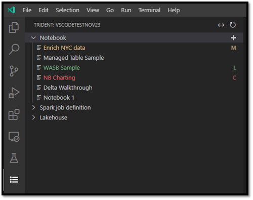
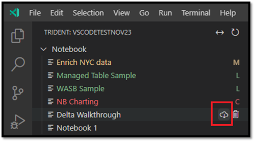
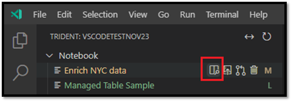
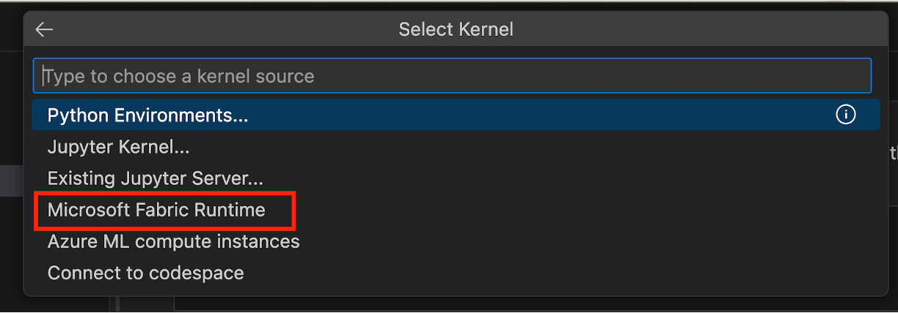
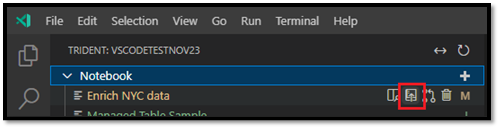
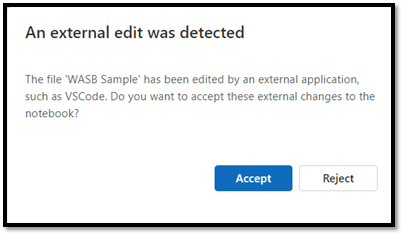
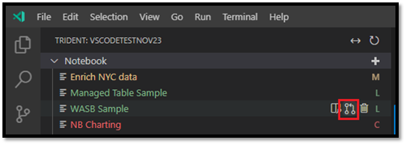
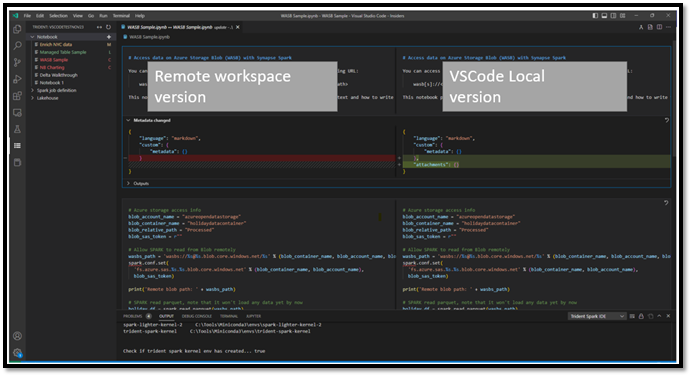
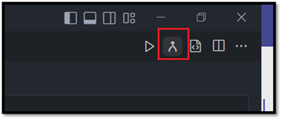
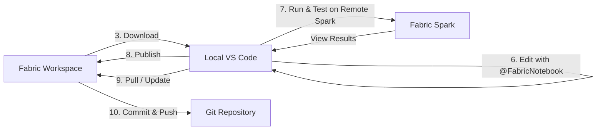

# Phase 2 · Notebook Development

**Goal:** fill in the three empty notebooks scaffolded in [Phase 1](01-initial-architecture-setup.md) — `01_bronze_ingest`, `02_silver_transform`, `03_gold_star_schema` — using the **Fabric Data Engineering VS Code extension** and the **FabricNotebook** custom agent in GitHub Copilot Chat.

> Grounded in [Section 2 — Develop Fabric Notebooks in VS Code](../docs/02-fabric-notebooks-vscode.md).

---

## Prerequisites

- The [**Fabric Data Engineering VS Code extension**](https://marketplace.visualstudio.com/items?itemName=SynapseVSCode.synapse), signed in to your workspace.
- The three empty notebooks from Phase 1 and the raw CSVs staged in `aw_bronze` under `Files/raw/`.

---

## Choose your editing mode: Local vs VFS

The extension offers two ways to edit notebooks ([source](https://learn.microsoft.com/fabric/data-engineering/setup-vs-code-extension#choose-a-workspace)). Pick the one that fits your workflow.

| | **Local mode** | **VFS mode** |
|---|---------------|--------------|
| Where files live | Downloaded to a local folder, synced back | Edited in place as remote files |
| Multiple workspaces at once | One at a time | Multiple in one window |
| Best for | Offline editing, **Git-based workflows** | Quick cross-workspace edits |

**This demo uses Local mode** — it's the best fit for Git-based workflows and provides full GitHub Copilot integration.

→ Full details: [2.2 Local mode vs. VFS mode](../docs/02-fabric-notebooks-vscode.md#22-local-mode-vs-vfs-mode).

---

## Working in Local Mode: Complete Workflow

> **Source:** [Create and manage Fabric notebooks in VS Code](https://learn.microsoft.com/en-us/fabric/data-engineering/author-notebook-with-vs-code)

### Understanding notebook states

The notebook list in the Fabric Data Engineering view shows the sync state of each notebook at a glance:



| Indicator | Color | Meaning |
|---|---|---|
| *(no character)* | White | **Default** — exists in the remote workspace, not downloaded locally yet |
| **M** | Yellow | **Modified** — downloaded and edited locally, changes not yet published |
| **L** | Green | **Local** — downloaded and in sync with the remote workspace |
| **C** | Red | **Conflict** — local and remote versions have diverged |

---

### Step 1: Configure Local Work Folder

Before downloading any notebooks, tell the extension where to store your local copies.

1. Open the **Command Palette** (`Ctrl+Shift+P`)
2. Run: **`Fabric Data Engineering: Set Local Work Folder`**
3. Choose or create a folder (e.g., `C:\dev\FabricLocal`)

Downloads will be organized as: `{WorkspaceId}/SynapseNotebook/{ArtifactId}/{NotebookName}/`

### Step 2: Connect to Your Fabric Workspace

1. Click the **Fabric Data Engineering** icon in the Activity Bar
2. Click **Select Workspace** and sign in if prompted
3. Choose your workspace — the extension lists all notebooks, lakehouses, and environments

### Step 3: Download a Notebook

Before you can edit a notebook's content, you must download it to VS Code.

1. In the Fabric view, hover over the notebook name — the **Download** icon appears beside it

   

2. Click **Download** — the notebook is saved to your local working directory and its state changes to **L** (green)

### Step 4: Open the Notebook

1. Hover over the downloaded notebook name — several icons appear, including **Open Notebook Folder**

   

2. Click **Open Notebook Folder** — the folder opens in VS Code Explorer and the `.ipynb` file opens in the editor

### Step 5: Add Fabric Compute (Kernel)

To run cells on remote Spark, select the **Microsoft Fabric Runtime** kernel before running anything.

1. With the notebook open, click the kernel selector in the **top-right corner** of the editor
2. Choose **Microsoft Fabric Runtime** from the list

   

3. Select the language variant:

   | Language | Use when… |
   |---|---|
   | **PySpark** | Python + Spark (most common — used in this demo) |
   | **Python** | Pure Python, no Spark context |
   | **Spark SQL** | SQL-first notebooks |
   | **Scala** | Scala Spark code |

> No local Spark installation required. All execution happens on your remote Fabric workspace's Spark cluster.

### Step 6: Develop with GitHub Copilot

Now use the **@FabricNotebook** agent to generate code:

1. Open **GitHub Copilot Chat** (`Ctrl+Shift+I`)
2. In the chat panel:
   - **Session type** → **Local**
   - **Agent** → **@FabricNotebook**
3. Describe what you want the notebook to do in plain language

The agent will:
- Insert code cells directly into the open notebook
- Use the correct lakehouse paths (relative for default, ABFSS for others)
- Reuse the built-in `spark` session (no `SparkSession.builder` needed)
- Ask for confirmation before running cells

### Step 7: Test and Run Cells

1. Review the generated code in each cell
2. Press `Shift+Enter` or click **▶ Run** to execute on remote Spark
3. Outputs appear inline — DataFrames as tables, errors with full stack traces

**Debugging with the agent:**
```text
@FabricNotebook the cell failed with "AnalysisException: column not found". Fix it.
```
The agent reads cell outputs directly, diagnoses the issue, and proposes a corrected cell.

### Step 8: Publish Local Changes to the Remote Workspace

When your notebook is working correctly, push it back to Fabric.

1. Hover over the notebook name in the Fabric view — the **Publish** icon appears

   

2. Click **Publish** — the remote workspace is updated with your local changes
   - If local changes create merge conflicts, you are prompted to resolve them first

3. If a colleague has the same notebook open in the Fabric portal, they receive an **Accept / Reject** prompt:

   

   - **Accept** → your VS Code changes are saved in the workspace
   - **Reject** → your VS Code changes are ignored

> After publishing, the **M** marker disappears and the notebook returns to **L** state.

### Step 9: Pull Changes from the Remote Workspace

If someone edits the notebook in the Fabric portal while you have a local copy, pull their changes before continuing.

1. Hover over the notebook name — click the **Update Notebook** icon

   

2. VS Code pulls the latest remote version and opens the **diff editor** — remote on the left, local on the right:

   

3. Edit the left side to resolve any differences

4. When done, click **Merge** in the top-right corner of the diff editor:

   

   > Until you click **Merge**, the notebook stays in **Conflict** (**C**, red) state.

### Step 10: Commit Changes in the Fabric Portal

Publishing updates the notebook in Fabric but does not create a Git version. To version-control your work:

1. Open your **Fabric workspace** in a browser
2. Go to **Workspace Settings** → **Git integration** → **Source control**
3. Review uncommitted changes, add a commit message, and **Commit**
4. Push to your remote Git repository (Azure DevOps or GitHub)

---

### Local Mode Workflow Summary



**Key advantages:**
- ✅ Work offline with full Git integration
- ✅ Intelligent code generation with the @FabricNotebook agent
- ✅ Test on remote Fabric Spark — no local cluster needed
- ✅ Conflict detection and diff editor on publish/pull
- ✅ Version control via Fabric's Git integration

---

## VFS Mode (Alternative)

**VFS mode** edits remote files directly, across multiple workspaces — no download/publish cycle:
1. **Open a Remote Window** → **Open Fabric Data Engineering Workspaces**
2. Follow [Manage Fabric workspace with VS Code under VFS mode](https://learn.microsoft.com/fabric/data-engineering/manage-workspace-with-vs-code-vfs-mode)

| | Local mode | VFS mode |
|---|---|---|
| Offline editing | ✅ | ❌ |
| Git integration | ✅ Full | ⚠️ Source control panel only |
| Multiple workspaces | One at a time | ✅ Multiple in one window |
| @FabricNotebook agent | ✅ | ✅ |

---

## Ready to Build

Now that you understand the Local mode workflow (Steps 1-10 above), you're ready to develop the three notebooks. The instructions below use the **@FabricNotebook** agent configured in Step 6.

→ See also: [2.4 The Fabric Notebook custom agent](../docs/02-fabric-notebooks-vscode.md#24-the-fabric-notebook-custom-agent)

> **Key agent behaviors:**
> - Reuses the built-in `spark` session (no `SparkSession.builder` needed)
> - Uses **relative paths** for the default lakehouse (`aw_bronze`)
> - Uses full **ABFSS paths** for other lakehouses (`aw_silver`, `aw_gold`)
> - Discovers data sources before generating code (no assumptions about schema or paths)

---

## Notebook 1 — `01_bronze_ingest` (raw → Bronze)

Load every tab-separated CSV as-is into Bronze Delta tables.

```text
In this notebook, ingest the tab-separated CSVs from Files/raw/ in the default
lakehouse into Bronze Delta tables. For each of Sales, Targets, Product, Reseller,
Salesperson, Region, and SalespersonRegion, read with sep="\t", header=true, and
inferSchema=false (keep everything as strings at Bronze). Write each to a Delta
table named bronze_<name> (overwrite). Add an ingestion timestamp column
_ingested_at. Show the row count for each table when done.
```

✅ *Outcome:* `bronze_sales`, `bronze_targets`, `bronze_product`, `bronze_reseller`, `bronze_salesperson`, `bronze_region`, `bronze_salespersonregion`.

---

## Notebook 2 — `02_silver_transform` (Bronze → Silver)

Clean, typecast, and conform. This is where the messy AdventureWorks formatting gets fixed.

```text
Read the bronze_* tables and write cleaned Silver Delta tables (silver_*) to the
aw_silver lakehouse (use its ABFSS path). Apply these rules:
- Strip "$" and "," from Sales, Cost, Unit Price (Sales table), Standard Cost
  (Product), and Target (Targets), then cast to double.
- Parse the long text dates: Sales.OrderDate and Targets.TargetMonth are like
  "Friday, August 25, 2017" — convert to a proper date type.
- Cast all *Key and Quantity columns to int.
- Trim whitespace from every string column and drop exact duplicate rows.
- Rename columns with spaces or dashes to snake_case (e.g. "Standard Cost" ->
  standard_cost, "State-Province" -> state_province).
Show the schema and row count for each Silver table.
```

✅ *Outcome:* typed, deduplicated `silver_*` tables with clean numeric, date, and column names.

---

## Notebook 3 — `03_gold_star_schema` (Silver → Gold)

Shape the star schema described in [`data/README.md`](data/README.md), including a Date dimension.

```text
Read the silver_* tables and build the Gold star schema in the aw_gold lakehouse
(use its ABFSS path):
- Dimensions: dim_product, dim_reseller, dim_salesperson, dim_region — one row per
  key, descriptive attributes only.
- dim_date: generate a continuous date dimension covering the min/max of
  silver_sales.order_date and silver_targets.target_month, with columns date,
  year, quarter, month, month_name, year_month.
- Bridge: bridge_salesperson_region from silver_salespersonregion.
- Facts: fact_sales (grain: one row per sales order line, with a derived
  profit = sales - cost) and fact_targets (grain: one row per salesperson per month).
Keep foreign keys on the facts (product_key, reseller_key, employee_key,
salesterritory_key, order_date; and employee_id, target_month on targets).
Preview the top rows of each Gold table and report row counts.
```

✅ *Outcome:* a Gold star schema (`dim_*`, `dim_date`, `bridge_salesperson_region`, `fact_sales`, `fact_targets`) ready for Power BI.

---

## Run and Validate

As you develop each notebook, follow **Step 7** (Test and Run Cells Locally) from the workflow above:

1. Run cells using the **▶ Run** button or `Shift+Enter`
2. Cells execute on **remote Fabric Spark** (no local cluster required)
3. Review outputs inline — DataFrames render as tables, errors show stack traces
4. Use **@FabricNotebook** to debug and fix any issues

**Final validation prompt (for Gold layer):**

```text
Explore fact_sales joined to dim_date: show total sales and total quantity by
year_month, and the three months with the highest total sales.
```

→ More details: [2.3 Author and run notebooks](../docs/02-fabric-notebooks-vscode.md#23-author-and-run-notebooks)

✅ *Outcome:* A working Bronze → Silver → Gold pipeline over AdventureWorks reseller sales.

---

## Publish and Commit

Once all three notebooks are working:

1. **Publish to Fabric** (Step 9): Right-click each notebook in the Fabric view → **Publish**
   - The extension handles conflict detection and merging automatically
2. **Commit in Fabric Portal** (Step 10): Open Fabric workspace → **Source control** → Commit and push changes
3. **Optional — Local Git**: If your local work folder is in a Git repo, commit the local `.ipynb` files as well

→ See **Steps 9-10** in the Local Mode workflow above for detailed instructions.

✅ *Outcome:* Notebooks versioned in Git and ready for production use in Fabric.

---

**Next:** [Phase 3 — Power BI Development & Optimization →](03-powerbi-development-optimization.md)
