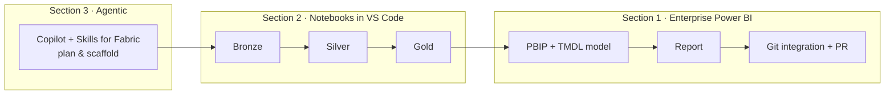

# Contoso end-to-end demo: build an enterprise Fabric solution

This demo walks a single, realistic scenario through **all three sections** of this repository so your customers can test every capability on one storyline — then adapt each step to one of **their own** datasets.

> **Scenario — Contoso Retail.** Contoso wants a governed sales-analytics solution: raw sales files land in a lakehouse, are cleaned and modeled through a medallion architecture, surfaced in a Git-versioned Power BI semantic model and report, and the whole thing is built with AI assistance and shipped through pull requests.



---

## Before you start

Complete the [prerequisites in the root README](../README.md#prerequisites-at-a-glance). At minimum you need a Fabric-enabled workspace, VS Code with GitHub Copilot Chat, Power BI Desktop, Node.js, the Azure CLI, and an Azure DevOps or GitHub repo.

Sample data and a prompt library are provided:

- [`data/contoso_sales_sample.csv`](data/contoso_sales_sample.csv) — a tiny sales extract to ingest.
- [`prompts/`](prompts/) — copy-paste prompts for each stage.

**Bring your own scenario:** anywhere you see Contoso sales data, substitute one of your own CSV/Parquet extracts and adjust column names. The steps stay identical.

---

## Stage 0 — Set up source control (Section 1)

Establish the enterprise backbone first: **Git**.

1. Create an empty repo in **Azure DevOps** or **GitHub**.
2. In your Fabric workspace: **Workspace settings → Git integration**, connect your provider, pick a branch and folder, and **Connect and sync**.
   → Full steps: [1.1 Source control with Git integration](../docs/01-enterprise-power-bi-development.md#11-source-control-with-git-integration).
3. Clone the repo locally and open it in VS Code.

✅ *Outcome:* your workspace is versioned; every later change becomes a reviewable commit.

---

## Stage 1 — Scaffold the solution with an agent (Section 3)

Let AI plan and create the Fabric items.

1. Install **Skills for Fabric** and authenticate:
   ```bash
   git clone https://github.com/microsoft/skills-for-fabric.git
   az login
   az account get-access-token --resource https://api.fabric.microsoft.com
   ```
   ```text
   /plugin marketplace add microsoft/skills-for-fabric
   /plugin install fabric-skills@fabric-collection
   ```
   → Details: [3.2 Setup](../docs/03-fabric-agentic-development.md#setup-recap).
2. Drive the scaffold with a prompt (see [`prompts/01-agentic-scaffold.md`](prompts/01-agentic-scaffold.md)):
   ```text
   Use Microsoft Fabric skills to design a medallion architecture for Contoso
   retail sales. Create Bronze, Silver, and Gold lakehouses in my workspace and
   outline the notebooks needed to ingest, clean, and aggregate the data.
   ```

✅ *Outcome:* Bronze/Silver/Gold lakehouses exist and you have a plan for the notebooks.

---

## Stage 2 — Build the medallion lakehouse in VS Code (Section 2)

Author and run the transformation notebooks.

1. Install the [Fabric Data Engineering VS Code extension](https://marketplace.visualstudio.com/items?itemName=SynapseVSCode.synapse) and select your workspace.
   → [2.1 Get started](../docs/02-fabric-notebooks-vscode.md#21-get-started-with-the-extension).
2. Upload [`data/contoso_sales_sample.csv`](data/contoso_sales_sample.csv) to the **Bronze** lakehouse `Files/raw/` area.
3. Open **GitHub Copilot Chat**, select **Local** session type and the **FabricNotebook** agent, and generate the three notebooks (see [`prompts/02-notebooks.md`](prompts/02-notebooks.md)):
   - **Bronze:** load the raw CSV into a Delta table `bronze_sales`.
   - **Silver:** clean/typecast/deduplicate into `silver_sales`.
   - **Gold:** aggregate into `gold_sales_by_month` and `gold_sales_by_product`.
   → [2.4 Fabric Notebook custom agent](../docs/02-fabric-notebooks-vscode.md#24-the-fabric-notebook-custom-agent).
4. Run the notebooks on remote Spark and verify the Gold tables.

✅ *Outcome:* a working Bronze → Silver → Gold pipeline over Contoso sales.

---

## Stage 3 — Model and report in PBIP + TMDL (Section 1)

Turn the Gold layer into a governed semantic model.

1. In Power BI Desktop, connect to the **Gold** lakehouse tables and build a starter model + report.
2. Enable **Power BI Project (.pbip)** and **Store semantic model using TMDL format**, then **Save as → Power BI Project**.
   → [1.2 PBIP + TMDL](../docs/01-enterprise-power-bi-development.md#12-the-pbip-folder-structure-and-tmdl-files).
3. Open the PBIP folder in VS Code (install the [TMDL extension](https://marketplace.visualstudio.com/items?itemName=analysis-services.TMDL)).
4. Install and connect the **Power BI Modeling MCP Server**:
   - Install the [VS Code extension](https://aka.ms/powerbi-modeling-mcp-vscode).
   - In Copilot Chat: `Open semantic model from PBIP folder '<path>/Contoso.SemanticModel/definition'`.
   → [1.4 Power BI Modeling MCP Server](../docs/01-enterprise-power-bi-development.md#14-the-power-bi-modeling-mcp-server).
5. Use Copilot to enrich the model (see [`prompts/03-model-optimize-document.md`](prompts/03-model-optimize-document.md)):
   - Add measures (Total Sales, YoY %, Rolling 3-month average).
   - Add descriptions/notes to every table, column, and measure.
   - Enforce naming conventions and refactor time-intelligence into a calculation group.
   - Generate model documentation as Markdown.

✅ *Outcome:* an optimized, documented semantic model stored as reviewable TMDL text.

---

## Stage 4 — Ship it through a pull request (Sections 1 & 3)

1. In VS Code, review the **TMDL diff** for the model changes.
2. Commit on a feature branch and **push**.
3. Open a **pull request**; if you configured a [PBIP build pipeline](https://learn.microsoft.com/power-bi/developer/projects/projects-build-pipelines), let the quality gate run.
4. Merge to `main`; in the Fabric workspace, use **Source control → Update all** to bring the change into the shared workspace.
   → [The daily inner loop](../docs/01-enterprise-power-bi-development.md#the-daily-inner-loop).

✅ *Outcome:* an end-to-end, AI-assisted, source-controlled Fabric solution — reviewed and deployed like software.

---

## What the customer just proved

| Capability | Where it happened |
|-----------|-------------------|
| Git integration & PR-based delivery | Stages 0 & 4 |
| PBIP folder structure + TMDL | Stage 3 |
| Skills for Fabric in VS Code | Stages 1 & 2 |
| Power BI Modeling MCP Server | Stage 3 |
| GitHub Copilot on PBIP | Stage 3 |
| Fabric notebooks in VS Code | Stage 2 |
| Agentic end-to-end build | Stages 1–4 |

Adapt any stage to the customer's real data and repeat — the workflow is identical.
