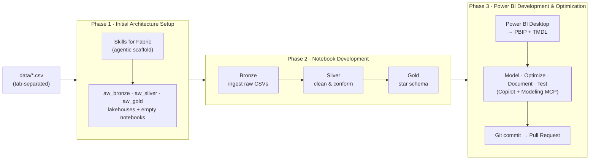
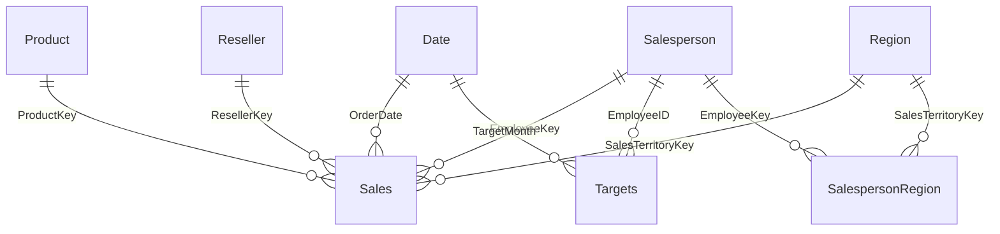

# AdventureWorks end-to-end demo

Build a governed, enterprise-grade sales-analytics solution on Microsoft Fabric — from raw files to an optimized, documented Power BI semantic model — with AI assistance at every step.

> **Scenario — AdventureWorks reseller sales.** The tab-separated CSVs in [`data/`](data/) (Sales, Targets, Product, Reseller, Salesperson, Region, and a salesperson↔region bridge) land in a **Bronze** lakehouse, are cleaned and conformed through a **Silver** layer, and are shaped into a **Gold** star schema. The Gold model is surfaced in a Git-versioned Power BI semantic model (PBIP + TMDL) and continuously improved with GitHub Copilot.

This demo is organized into three phases. Do them in order, or jump to the one you want to showcase.

| Phase | Guide | What you do |
|-------|-------|-------------|
| 1 | [Initial Architecture Setup](01-initial-architecture-setup.md) | Deploy the medallion lakehouses and scaffold empty notebooks with **Skills for Fabric** (agentic). |
| 2 | [Notebook Development](02-notebook-development.md) | Fill in the Bronze → Silver → Gold notebooks in VS Code (local vs VFS mode) with the **FabricNotebook** agent. |
| 3 | [Power BI Development & Optimization](03-powerbi-development-optimization.md) | Build the model in Power BI Desktop, save as **PBIP + TMDL**, then model, optimize, document, and test with the **Power BI Modeling MCP Server**. |

## The end-to-end picture

## The target star schema (Gold)

The Gold layer implements a classic star schema. Full column-level detail and modeling notes are in [`data/README.md`](data/README.md).

## Before you start

Complete the [prerequisites in the root README](../README.md#prerequisites-at-a-glance): a Fabric-enabled workspace, VS Code with GitHub Copilot Chat, Power BI Desktop, Node.js, the Azure CLI, and an Azure DevOps or GitHub repo.

- **Sample data:** the tab-separated CSVs in [`data/`](data/) — see [`data/README.md`](data/README.md) for the source (Kaggle / PL-300 lab) and format details.
- **Bring your own scenario:** anywhere you see AdventureWorks sales data, substitute one of your own extracts and adjust column names. The workflow stays identical.

## What this demo proves

| Capability | Where it happens |
|-----------|------------------|
| Agentic scaffolding with Skills for Fabric | [Phase 1](01-initial-architecture-setup.md) |
| Medallion lakehouse architecture (Bronze/Silver/Gold) | Phases [1](01-initial-architecture-setup.md) & [2](02-notebook-development.md) |
| Fabric notebooks in VS Code (local & VFS mode) | [Phase 2](02-notebook-development.md) |
| FabricNotebook custom agent | [Phase 2](02-notebook-development.md) |
| PBIP folder structure + TMDL | [Phase 3](03-powerbi-development-optimization.md) |
| Power BI Modeling MCP Server + Copilot | [Phase 3](03-powerbi-development-optimization.md) |
| Git integration & PR-based delivery | Phases [1](01-initial-architecture-setup.md) & [3](03-powerbi-development-optimization.md) |
