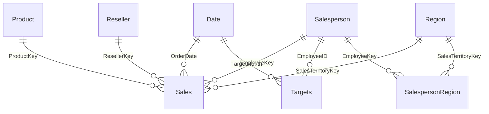

# Data Source

The data in this folder was extracted from Kaggle:

- **Dataset:** [Adventure Works in Excel Tables](https://www.kaggle.com/datasets/algorismus/adventure-works-in-excel-tables/data)

## Kaggle's Noted Origin

Kaggle noted that the data was extracted from the following source:

> The data was provided to practice on a Power BI case study for the **PL-300 Microsoft Power BI Data Analyst** training. The first two steps (as per the lab) of importing data are executed on Power BI running on a virtual machine, and later the tables from Power BI are copied as CSVs.

- **Source lab:** [Prepare data in Power BI (PL-300)](https://learn.microsoft.com/en-us/training/modules/get-data/lab-prepare)

## File Format

All CSV files in this folder are **tab-separated** (`\t`), not comma-separated, despite the `.csv` extension. Tabs are used because several values contain embedded commas (for example, `HL Road Frame - Black, 58` and `$2,024.99`).

When ingesting these files, set the delimiter to tab (e.g. `sep="\t"` in Spark/Pandas, or **Column delimiter = Tab** in a Fabric pipeline / Dataflow).

## Files

| File | Role | Grain |
|------|------|-------|
| `Sales.csv` | Fact | One row per product per sales order line |
| `Targets.csv` | Fact | One row per salesperson per month |
| `Product.csv` | Dimension | One row per product |
| `Reseller.csv` | Dimension | One row per reseller |
| `Salesperson.csv` | Dimension | One row per salesperson |
| `Region.csv` | Dimension | One row per sales territory |
| `SalespersonRegion.csv` | Bridge | Salesperson ↔ territory assignments (many-to-many) |

## Suggested Star Schema Semantic Model

This dataset maps cleanly to a classic star schema for a Power BI semantic model.

### Fact tables

- **`Sales`** — measures: `Quantity`, `Unit Price`, `Sales`, `Cost` (plus a derived `Profit = Sales − Cost`). Foreign keys: `ProductKey`, `ResellerKey`, `EmployeeKey`, `SalesTerritoryKey`, `OrderDate`.
- **`Targets`** — measure: `Target`. Keys: `EmployeeID` (→ salesperson), `TargetMonth` (→ date).

### Dimension tables

| Dimension | Key | Attributes |
|-----------|-----|------------|
| `Product` | `ProductKey` | Product, Standard Cost, Color, Subcategory, Category |
| `Reseller` | `ResellerKey` | Business Type, Reseller, City, State-Province, Country-Region |
| `Salesperson` | `EmployeeKey` | Salesperson, Title, UPN, EmployeeID |
| `Region` | `SalesTerritoryKey` | Region, Country, Group |
| `Date` ⭐ | `DateKey` | Date, Year, Quarter, Month, MonthName (create this table) |

### Special relationships

- **`SalespersonRegion`** is a **bridge table** modeling the many-to-many relationship between salespeople and territories. Use it between `Salesperson` and `Region` rather than as a fact or dimension.
- `Sales` also carries its own `SalesTerritoryKey` (the territory where the sale occurred). Following the PL-300 lab guidance, relate `Region` directly to `Sales`, and use the bridge only for salesperson-to-region assignments.

### Diagram

### Key modeling steps

1. **Add a Date dimension** and mark it as a date table. Neither fact has a real date key — only text dates (`Friday, August 25, 2017`) and month dates (`TargetMonth`) that must be parsed.
2. **Clean numeric columns** — strip `$` and `,` from `Sales`, `Cost`, `Unit Price`, `Standard Cost`, and `Target`, then cast to decimal.
3. **`Targets` joins on `EmployeeID`**, not `EmployeeKey` — relate `Targets` → `Salesperson[EmployeeID]`, or map `EmployeeID` to `EmployeeKey` during load.
4. **Bridge cross-filter direction** — set `SalespersonRegion` to filter both directions if Region needs to slice salespeople and vice versa.
5. **Hide keys and the bridge table** from report view; surface only measures and descriptive attributes.
