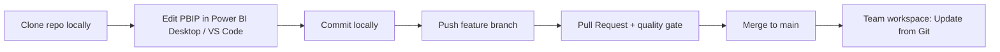
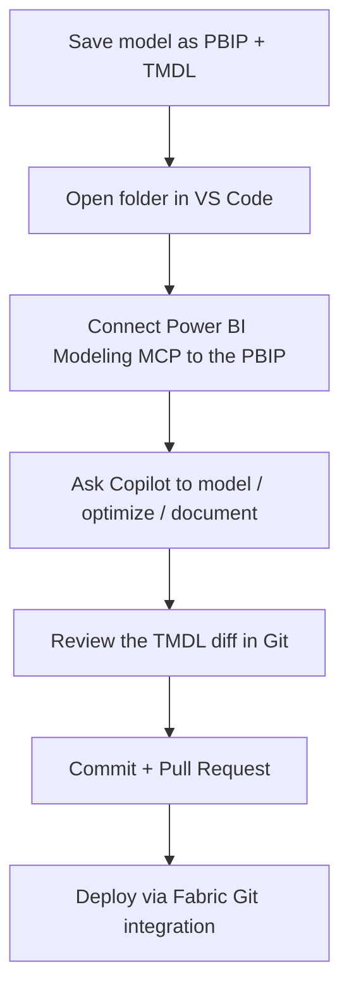

# 1. Enterprise Power BI Development

Moving Power BI from single-author `.pbix` files to an enterprise engineering practice means treating your semantic models and reports as **source code**: versioned in Git, reviewed through pull requests, edited in a real code editor, and increasingly, developed with the help of AI agents.

This section covers:

1. [Source control with Git integration](#11-source-control-with-git-integration)
2. [The PBIP folder structure and TMDL files](#12-the-pbip-folder-structure-and-tmdl-files)
3. [Skills for Fabric in VS Code](#13-skills-for-fabric-in-vs-code)
4. [The Power BI Modeling MCP Server](#14-the-power-bi-modeling-mcp-server)
5. [Developing with GitHub Copilot on top of PBIP](#15-developing-with-github-copilot-on-top-of-pbip)

---

## 1.1 Source control with Git integration

**Fabric Git integration** connects a Fabric workspace to a remote Git repository (Azure DevOps or GitHub). It lets content creators track and manage changes, collaborate through branches, and revert to previous versions — the foundation of enterprise application lifecycle management (ALM).

Source: [Introduction to Git integration](https://learn.microsoft.com/fabric/cicd/git-integration/intro-to-git-integration) · [Get started with Git integration](https://learn.microsoft.com/fabric/cicd/git-integration/git-get-started)

### Why it matters

- **Version history** — every commit is a restore point for your semantic models and reports.
- **Collaboration** — developers work in isolated [branches](https://learn.microsoft.com/fabric/cicd/git-integration/manage-branches) and merge through pull requests.
- **Quality gates & CI/CD** — pull requests can trigger build pipelines that validate model and report quality before changes reach a shared workspace. See [PBIP and Azure DevOps build pipelines for validation](https://learn.microsoft.com/power-bi/developer/projects/projects-build-pipelines).

### Prerequisites

Git integration requires (from [Git integration prerequisites](https://learn.microsoft.com/fabric/cicd/git-integration/git-get-started#prerequisites)):

**Fabric side**
- A [Fabric capacity](https://learn.microsoft.com/fabric/enterprise/licenses#capacity) (or a [free trial](https://learn.microsoft.com/fabric/fundamentals/fabric-trial)); Premium/PPU capacities can be used but some SKUs only support Power BI items.
- These [tenant switches](https://learn.microsoft.com/fabric/admin/git-integration-admin-settings) enabled (by tenant, capacity, or workspace admin):
  - **Users can create Fabric items**
  - **Users can synchronize workspace items with their Git repositories**
  - **Users can synchronize workspace items with GitHub repositories** (GitHub only)

**Git side**
- **Azure DevOps:** an active account registered to the same Fabric user, with access to a repository.
- **GitHub:** an active account and a [personal access token](https://docs.github.com/en/authentication/keeping-your-account-and-data-secure/managing-your-personal-access-tokens) — a **fine-grained token** (recommended) with **Contents** read *and* write permission, or a **classic token** with `repo` scope.

### Step-by-step: connect a workspace to Git

Only a **workspace admin** can connect a workspace to a repository. Once connected, anyone with the right permissions can work in it.

1. Sign in to Fabric and navigate to the workspace you want to connect.
2. Open **Workspace settings**.
3. Select **Git integration**.
4. Select your Git provider (**Azure DevOps** or **GitHub**).
5. **Authenticate:**
   - *Azure DevOps* — select **Connect** to sign in with the Azure Repos account registered to your Fabric (Microsoft Entra) user. To add a new identity, choose **Add account** and provide a display name, the Azure DevOps URL (`https://dev.azure.com/{organization}/{project}/_git/{repository}`), and an authentication method (OAuth2 or Service Principal).
   - *GitHub* — sign in and, on first use, choose **Add account** and provide a display name, your personal access token, and optionally a repository URL.
6. **Choose the branch and folder** to connect to:
   - Organization / Project / Git repository (Azure DevOps) or Repository URL (GitHub).
   - **Branch** — pick an existing branch or **+ New Branch**. You can connect to one branch at a time.
   - **Folder** — an existing or new folder; leave blank to use the repo root. You can connect to one folder at a time.
7. Select **Connect and sync**.

> During the initial sync, if one side is empty, content is copied from the non-empty side. If both have content, you'll be asked which direction to sync. See [Connect and sync](https://learn.microsoft.com/fabric/cicd/git-integration/git-integration-process#connect-and-sync).

After connecting, the workspace shows the connected branch, each item's status, and the last sync time.

### The daily inner loop

Once connected, the **Source control** panel in the workspace drives the loop:

**Commit changes to Git**
1. Open the workspace and select the **Source control** icon (it shows the number of uncommitted changes).
2. Select **Changes**. Each changed item is flagged as *new*, *modified*, *conflict*, *same change*, or *deleted*.
3. Select the items to commit, add a comment, and select **Commit**. Committed items move from **Uncommitted** to **Synced**.

**Update workspace from Git**
1. When someone commits to the connected branch, a notification appears in the workspace.
2. Select the **Source control** icon → **Updates** → **Update all** → confirm.

**Disconnect** (admin only): **Workspace settings** → **Git integration** → **Disconnect workspace**.

### Team workflow with client tools (Power BI Desktop)

Developers who use Power BI Desktop typically follow this flow (source: [Development process using client tool](https://learn.microsoft.com/fabric/cicd/git-integration/client-tool) and [Manage branches](https://learn.microsoft.com/fabric/cicd/git-integration/manage-branches)):

1. **Clone** the repo to a local machine (once).
2. Open the project in Power BI Desktop from the local **PBIP**.
3. Make changes, save locally, and **commit** to the local repo.
4. **Push** the branch and commits to the remote repo.
5. Test by connecting the branch to a **separate workspace** and using **Update all** in the source control panel.
6. Open a **pull request**; once merged, the shared team workspace is prompted to **update** and everyone sees the change.



---

## 1.2 The PBIP folder structure and TMDL files

To version Power BI content effectively, you need it as **plain text**, not a binary `.pbix`. That's what **Power BI Project (PBIP)** format provides.

Source: [Power BI Desktop projects (PBIP)](https://learn.microsoft.com/power-bi/developer/projects/projects-overview) · [Project semantic model folder](https://learn.microsoft.com/power-bi/developer/projects/projects-dataset) *(PBIP is currently in preview)*

### What is PBIP?

When you save your work as a **Power BI Project**, the report and semantic model *item* definitions are saved as individual, human-readable text files in an intuitive folder structure. Benefits (from the official docs):

- **Text editor support** — human-readable, publicly documented files. Best edited in [VS Code](https://code.visualstudio.com/) for IntelliSense, validation, and Git integration.
- **Folder structure transparency** — separate folders for the semantic model and report, so you can copy a table between projects or reuse report pages.
- **Source control ready** — designed for seamless Git integration and team collaboration.
- **CI/CD support** — apply quality gates and automate deployment.
- **Programmatic generation & editing** — modify definitions in batch (e.g., add a set of measures to every table) or with the [Tabular Object Model (TOM)](https://learn.microsoft.com/analysis-services/tom/introduction-to-the-tabular-object-model-tom-in-analysis-services-amo).

### Enable and save as PBIP

1. In Power BI Desktop, go to **File → Options and settings → Options → Preview features** and enable **Power BI Project (.pbip) save option**.
2. Use **File → Save as** and choose the **Power BI Project** type.

### Root folder layout

```md
Project/
├── AdventureWorks.Report/          # report item definition (folder of text files)
├── AdventureWorks.SemanticModel/   # semantic model item definition (folder of text files)
├── .gitignore                      # excludes caches/local settings from Git
└── AdventureWorks.pbip             # pointer file that opens the report + model
```

- **`<name>.SemanticModel`** — files and folders representing the semantic model.
- **`<name>.Report`** — files and folders representing the report.
- **`.gitignore`** — created automatically; ignores `**/.pbi/localSettings.json` and `**/.pbi/cache.abf`.
- **`<name>.pbip`** — a pointer to the report folder; opening it opens the report and its model. The `.pbip` file is *optional* — you can also open `definition.pbir` inside the report folder directly.

You can keep multiple reports and semantic models in the same folder:

```md
project/
├── AdventureWorks-Sales.Report/
│   └── definition.pbir
├── AdventureWorks-Stocks.Report/
│   └── definition.pbir
├── AdventureWorks.SemanticModel/
│   └── definition.pbism
├── .gitignore
└── AdventureWorks.pbip
```

### Inside the semantic model folder

Depending on the format, the semantic model folder can include (source: [Project semantic model folder](https://learn.microsoft.com/power-bi/developer/projects/projects-dataset)):

- **`.pbi\`** — local settings and caches (`localSettings.json`, `editorSettings.json`, `cache.abf`, `unappliedChanges.json`).
- **`definition.pbism`** — the overall semantic model definition and core settings. Its `version` property controls the allowed format: `1.0` = TMSL only; `4.0`+ = TMSL **or** TMDL.
- **`model.bim`** — present only when saved as **TMSL** (a single JSON [Database object](https://learn.microsoft.com/analysis-services/tmsl/database-object-tmsl)).
- **`definition\` folder** — present only when saved as **TMDL** (replaces `model.bim`).
- **`diagramLayout.json`**, `.platform`, and optional **`DAXQueries\`** / **`TMDLScripts\`** folders.

### TMDL: Tabular Model Definition Language

For the best source-control and co-development experience, save the semantic model using **TMDL** instead of a single `model.bim` JSON file.

Source: [TMDL overview](https://learn.microsoft.com/analysis-services/tmdl/tmdl-overview) · [TMDL format](https://learn.microsoft.com/power-bi/developer/projects/projects-dataset#tmdl-format)

**Why TMDL over TMSL (`model.bim`)?**

- TMDL is **designed to be human-friendly** — a YAML-like syntax that is easy to read *and* edit in any text editor.
- Instead of one large JSON file, TMDL uses a **folder structure with a separate file per table, perspective, role, and culture**. This makes the model easy to understand just by browsing the folders.
- The result is **clean Git diffs and far fewer merge conflicts** — the single biggest pain point of versioning `.pbix`/`.bim`.
- It makes reusing model objects (like a shared date table) between models trivial.

**TMDL folder shape (conceptual):**

```md
AdventureWorks.SemanticModel/
├── definition.pbism
└── definition/
    ├── model.tmdl
    ├── database.tmdl
    ├── relationships.tmdl
    ├── cultures/
    │   └── en-US.tmdl
    ├── perspectives/
    ├── roles/
    └── tables/
        ├── Sales.tmdl
        ├── Product.tmdl
        └── Date.tmdl
```

**Example TMDL (a measure on a table):**

```tmdl
table Sales
    measure 'Total Sales' = SUMX ( Sales, Sales[Quantity] * Sales[Unit Price] )
        formatString: "\$#,0"
        displayFolder: "Key Measures"

    column Quantity
        dataType: int64
        summarizeBy: sum
        sourceColumn: Quantity
```

**Upgrade an existing PBIP to TMDL:**
1. Open the PBIP in Power BI Desktop.
2. Enable **File → Options → Preview features → Store semantic model using TMDL format**.
3. **Save** the project and select **Upgrade** when prompted. The `model.bim` file is replaced by a `\definition` folder.

> ⚠️ Once you upgrade to TMDL, you **can't revert** to TMSL — save a copy of your PBIP first if you might need to.

**Edit TMDL outside Power BI Desktop:**
- Install the [**TMDL VS Code extension**](https://marketplace.visualstudio.com/items?itemName=analysis-services.TMDL) for syntax highlighting, IntelliSense, and error diagnostics.
- Open the PBIP folder in VS Code and edit files under `definition\`.
- **Restart Power BI Desktop** to reload external changes — Desktop is not aware of edits made by other tools.
- You can also work with the [**TMDL view** in Power BI Desktop](https://learn.microsoft.com/power-bi/transform-model/desktop-tmdl-view) to script objects and apply changes live.

**A few enterprise tips (from the official limitations):**
- Configure Git to handle line endings with [`autocrlf`](https://docs.github.com/en/get-started/getting-started-with-git/configuring-git-to-handle-line-endings) — Power BI Desktop uses CRLF.
- Use a **short root path** for PBIP folders (Windows 260-character path limit).
- Save externally edited files as **UTF-8 without BOM**.

---

## 1.3 Skills for Fabric in VS Code

**Skills for Fabric** are reusable AI-assistant instructions for working with Microsoft Fabric. They teach GitHub Copilot and compatible AI coding tools about Fabric workloads, APIs, query patterns, and operational best practices — so the AI produces Fabric-correct code and follows Microsoft best practices.

Official repository: [github.com/microsoft/skills-for-fabric](https://github.com/microsoft/skills-for-fabric) (MIT-licensed)

### What's included

The repo ships several bundles ([see the README](https://github.com/microsoft/skills-for-fabric#what-is-included)):

| Bundle | Focus |
|--------|-------|
| `fabric-skills` | The complete bundle: authoring, consumption, operations, migration, and end-to-end architecture. |
| `fabric-authoring` | Creating/managing Fabric items via REST APIs, CLI automation, notebooks, T-SQL, KQL, Dataflows Gen2, Eventstreams, and semantic models. |
| `fabric-consumption` | Read-only exploration and querying across Warehouses, Lakehouses, Power BI semantic models, Eventhouse/KQL, Eventstreams, Dataflows Gen2, and catalog search. |
| `fabric-operations` | Performance and health diagnostics, including warehouse query insights and slow-query investigation. |
| `powerbi-authoring` | Authoring Power BI semantic models, reports, and **PBIP** workflows. |

The full bundle also covers SQL data warehouse, Spark/Lakehouse, Eventhouse/KQL, Eventstreams, Dataflows Gen2, catalog search, migration scenarios, and **medallion architecture** workflows.

### Install with GitHub Copilot CLI

The recommended path is the [GitHub Copilot CLI](https://docs.github.com/copilot/github-copilot-in-the-cli) plugin marketplace ([source](https://github.com/microsoft/skills-for-fabric#install-with-github-copilot-cli)):

```text
# Add the public marketplace
/plugin marketplace add microsoft/skills-for-fabric

# Install the full bundle (except powerbi-authoring)
/plugin install fabric-skills@fabric-collection
```

Or install a focused bundle:

```text
/plugin install fabric-authoring@fabric-collection      # authoring
/plugin install fabric-consumption@fabric-collection    # consumption
/plugin install fabric-operations@fabric-collection     # operations
/plugin install powerbi-authoring@fabric-collection     # Power BI + PBIP
```

You can also filter the full bundle by workload:

```text
/plugin install fabric-skills@fabric-collection --filter "sqldw-*"
/plugin install fabric-skills@fabric-collection --filter "spark-*"
/plugin install fabric-skills@fabric-collection --filter "eventhouse-*"
```

### Use it in VS Code

Skills for Fabric works with GitHub Copilot and compatible AI coding tools. To use the skills alongside VS Code:

1. Install [VS Code](https://code.visualstudio.com/download) and the [GitHub Copilot Chat](https://marketplace.visualstudio.com/items?itemName=GitHub.copilot-chat) extension.
2. **Clone the repository** so the AI tooling picks up its instruction files automatically. The repo includes root-level configuration for multiple tools — `CLAUDE.md` (Claude Code), `.cursorrules` (Cursor), `.windsurfrules` (Windsurf), `AGENTS.md` (Codex/Jules/OpenCode), and `GEMINI.md` (Gemini CLI) — which are discovered automatically when the repo is cloned ([source](https://github.com/microsoft/skills-for-fabric#other-ai-coding-tools)).

```bash
git clone https://github.com/microsoft/skills-for-fabric.git
```

3. **Authenticate to Fabric.** Most Fabric operations require Azure auth ([source](https://github.com/microsoft/skills-for-fabric#authentication)):

```bash
az login
az account get-access-token --resource https://api.fabric.microsoft.com
```

4. **Open Copilot in the project folder and ask for a Fabric task**, for example:

```text
Use Microsoft Fabric skills to design a medallion architecture for NYC taxi data.
```

> **Skills vs. MCP servers:** *Skills* provide guidance and patterns; *MCP servers* provide live tool access to data sources and APIs. Some bundles include MCP configuration, and you can register additional Fabric MCP servers. See [MCP setup](https://github.com/microsoft/skills-for-fabric/blob/main/mcp-setup/README.md).

### Try an example prompt

The repo ships example prompts you can adapt ([prompt_examples](https://github.com/microsoft/skills-for-fabric/tree/main/prompt_examples)):

- [Document my workspace](https://github.com/microsoft/skills-for-fabric/blob/main/prompt_examples/DocumentMyWorkspace.txt)
- [NYC Taxi medallion architecture](https://github.com/microsoft/skills-for-fabric/blob/main/prompt_examples/NYCTaxi_MedallionArchitecture.txt)
- [Analytics PDF report](https://github.com/microsoft/skills-for-fabric/blob/main/prompt_examples/NYC_AnalyzeExistingDataCreatePDF.txt)
- [Dashboard app](https://github.com/microsoft/skills-for-fabric/blob/main/prompt_examples/DashboardApp.txt)

---

## 1.4 The Power BI Modeling MCP Server

The **Power BI Modeling MCP Server** implements the [Model Context Protocol](https://modelcontextprotocol.io/introduction) to connect AI agents directly to Power BI **semantic models**. It lets you use natural language (or autonomous agents) to create and modify tables, columns, measures, relationships, calculation groups, RLS roles, translations, and more — across Power BI Desktop, Fabric workspaces, and **PBIP** files.

Official repository: [github.com/microsoft/powerbi-modeling-mcp](https://github.com/microsoft/powerbi-modeling-mcp) (MIT-licensed, **Public Preview**)

### What you can do

From the [official README](https://github.com/microsoft/powerbi-modeling-mcp#-what-can-you-do):

- **Build and modify semantic models with natural language** — create/update tables, columns, measures, and relationships.
- **Bulk operations at scale** — batch renames, refactors, translations, or security rules with transaction support.
- **Apply modeling best practices** — evaluate and implement best-practice rules.
- **Agentic development workflows** — work directly with **TMDL and PBIP files**, enabling agents to plan and execute complex modeling tasks across your model codebase.
- **Query and validate DAX** — execute and validate DAX to test measures and troubleshoot calculations.

📹 [End-to-end demo video](https://aka.ms/power-modeling-mcp-demo)

### Install in VS Code (recommended)

From the [Installation section](https://github.com/microsoft/powerbi-modeling-mcp#-installation):

1. Install [Visual Studio Code](https://code.visualstudio.com/download).
2. Install the [GitHub Copilot Chat](https://marketplace.visualstudio.com/items?itemName=GitHub.copilot-chat) extension.
3. Install the [**Power BI Modeling MCP VS Code extension**](https://aka.ms/powerbi-modeling-mcp-vscode).
4. Open GitHub Copilot Chat and confirm that **powerbi-modeling-mcp** appears and is selected in the tools list.

> If you don't see `powerbi-modeling-mcp` in the tool list, verify that the **MCP servers in Copilot** option is enabled in your Copilot settings on GitHub.com. For enterprise accounts this is disabled by default and must be enabled by an administrator.

**Model choice matters:** for best results, choose a deep-reasoning model such as **GPT-5** or **Claude Sonnet 4.5** ([source](https://github.com/microsoft/powerbi-modeling-mcp#-what-can-you-do)).

### Install manually (any MCP client)

Using NPX (requires [Node.js](https://nodejs.org/en)) — Node downloads the server from the [`@microsoft/powerbi-modeling-mcp` npm package](https://www.npmjs.com/package/@microsoft/powerbi-modeling-mcp):

```json
{
  "powerbi-modeling-mcp": {
    "type": "stdio",
    "command": "npx",
    "args": ["-y", "@microsoft/powerbi-modeling-mcp@latest", "--start"]
  }
}
```

### Get started: connect to a model

First connect to a semantic model — it can live in Power BI Desktop, a Fabric workspace, or **PBIP** files ([source](https://github.com/microsoft/powerbi-modeling-mcp#-get-started)):

```text
# Power BI Desktop
Connect to '[File Name]' in Power BI Desktop

# Fabric workspace
Connect to semantic model '[Semantic Model Name]' in Fabric Workspace '[Workspace Name]'

# Power BI Project (PBIP) files
Open semantic model from PBIP folder '[Path to the definition/ TMDL folder in the PBIP]'
```

Then drive modeling with natural language. Example scenarios from the docs:

- *"Analyze my model's naming conventions and suggest renames to ensure consistency."*
- *"Add descriptions to all measures, columns, and tables to clearly explain their purpose and explain the logic behind the DAX code in simple terms."*
- *"Generate a French translation for my model including tables, columns and measures."*
- *"Refactor measures 'Sales Amount 12M Avg' and 'Sales Amount 6M Avg' into a calculation group and include new variants: 24M and 3M."*
- *"Generate a Markdown document with complete, professional documentation for this model, using a mermaid diagram to illustrate relationships and documenting each measure's DAX and business logic."*

### Safety and settings

- **Confirmation prompts** — the server uses the MCP [Elicitation protocol](https://modelcontextprotocol.io/specification/2025-06-18/client/elicitation) and asks for approval before the **first modification** and the **first query** against a model. You can bypass with `--skipconfirmation` (use with caution and backups).
- **Read-only / read-write** — `--readwrite` is on by default; use `--readonly` for safe exploration.
- **Auth mode** — `--authmode interactive` (default) or `serviceprincipal` (set `AZURE_CLIENT_ID`, `AZURE_TENANT_ID`, and a secret/certificate).
- Configure options in VS Code user settings by searching `@ext:Microsoft.powerbi-modeling-mcp`.

> ⚠️ **Always back up your model before running operations.** LLMs can produce unexpected changes, and data/metadata retrieved by the server may be sent to your configured LLM provider. The server never bypasses Power BI security — it uses your existing credentials and RBAC. Review [Data Privacy](https://github.com/microsoft/powerbi-modeling-mcp#data-privacy-and-llm-providers) and [Security](https://github.com/microsoft/powerbi-modeling-mcp#security) in the README.

### Built-in tools (selection)

The server exposes granular tools your agent can call, including `connection_operations`, `database_operations`, `model_operations`, `table_operations`, `column_operations`, `measure_operations`, `relationship_operations`, `dax_query_operations`, `calculation_group_operations`, `security_role_operations`, `perspective_operations`, `culture_operations`, `object_translation_operations`, and `partition_operations`. See the full list in the [Available tools](https://github.com/microsoft/powerbi-modeling-mcp#%EF%B8%8F-available-tools) section.

VS Code also surfaces built-in **prompts** (type `/` in chat), such as `ConnectToPowerBIDesktop`, `ConnectToFabric`, `ConnectToPBIP`, `CreateDAXQuery`, and `AnalyzeDAXQuery`.

---

## 1.5 Developing with GitHub Copilot on top of PBIP

Because PBIP stores your model and report as **text**, GitHub Copilot in VS Code becomes a first-class Power BI development partner. Combine the three building blocks above:

- **PBIP + TMDL** give Copilot readable, editable source files.
- **Skills for Fabric** teach Copilot Fabric- and Power BI-correct patterns.
- **The Power BI Modeling MCP Server** gives Copilot live tools to safely apply modeling changes and validate DAX.

### A typical Copilot-assisted workflow



### High-value prompts to try

**Optimize the model**
```text
Review the DAX for all measures in this PBIP and suggest optimizations.
Flag measures that iterate unnecessarily and rewrite them using more
efficient patterns. Validate each rewrite with a DAX query before applying.
```

**Document the model (great for handover)**
```text
Generate a Markdown document that fully documents this semantic model:
a mermaid diagram of table relationships, every measure with its DAX and a
plain-language description of the business logic, row-level security filters,
and the data sources inferred from the Power Query code.
```

**Add descriptions / notes across the model**
```text
Add descriptions to every table, column, and measure in this model that
explain their business purpose. Keep them concise and consistent in tone.
```

**Enforce naming conventions**
```text
Analyze the naming convention of the 'Sales' table and apply the same
pattern consistently across the entire model, then show me the TMDL diff.
```

**Refactor for reuse**
```text
Refactor the time-intelligence measures into a calculation group and add
new variants (24M and 3M). Keep the existing measures working.
```

### Why review the diff

Every change an agent makes lands as a **TMDL text diff** you can review in Git before committing — this is exactly why the PBIP + TMDL + Git combination is the backbone of enterprise Power BI development. Keep AI changes behind pull requests and quality gates ([PBIP build pipelines](https://learn.microsoft.com/power-bi/developer/projects/projects-build-pipelines)).

---

## Where to go next

- **[Section 2 — Develop Fabric notebooks in VS Code](02-fabric-notebooks-vscode.md)**
- **[Section 3 — Fabric Agentic Development](03-fabric-agentic-development.md)**
- **[Contoso end-to-end demo](../demo/README.md)** — put all of this together on one scenario.
