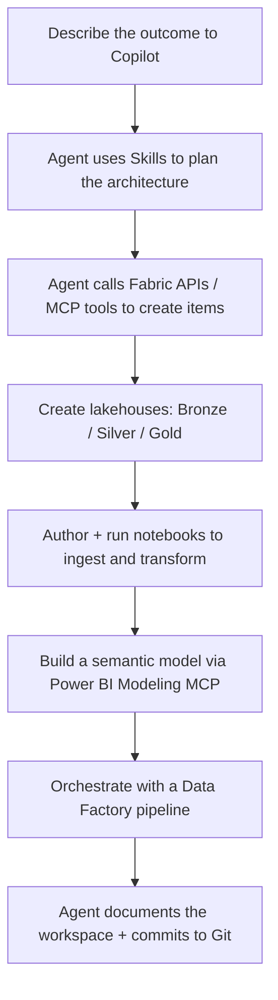

# 3. Fabric Agentic Development

**Agentic development** means letting AI agents plan and execute multi-step engineering tasks — not just autocomplete a line, but design a medallion architecture, create the lakehouses, write the notebooks, wire up a pipeline, and document the result. On Microsoft Fabric, this is powered by the combination of **Skills for Fabric** and **MCP servers**, driven from GitHub Copilot (in VS Code or the Copilot CLI).

This section covers:

1. [The agentic building blocks](#31-the-agentic-building-blocks)
2. [How Skills for Fabric enable end-to-end solutions](#32-how-skills-for-fabric-enable-end-to-end-solutions)
3. [A reference agentic workflow](#33-a-reference-agentic-workflow)
4. [Governance and safety](#34-governance-and-safety)

---

## 3.1 The agentic building blocks

| Building block | Role | Source |
|----------------|------|--------|
| **Skills for Fabric** | Reusable AI-assistant *instructions* that teach the agent Fabric workloads, APIs, query patterns, and best practices. | [github.com/microsoft/skills-for-fabric](https://github.com/microsoft/skills-for-fabric) |
| **MCP servers** | Give the agent *live tool access* to data sources and APIs (e.g., the [Power BI Modeling MCP Server](https://github.com/microsoft/powerbi-modeling-mcp)). | [MCP setup](https://github.com/microsoft/skills-for-fabric/blob/main/mcp-setup/README.md) |
| **GitHub Copilot** | The agent runtime — in VS Code or the [Copilot CLI](https://docs.github.com/copilot/github-copilot-in-the-cli). | [GitHub Copilot](https://docs.github.com/copilot) |
| **Azure CLI auth** | Provides the Fabric access token the agent uses to call Fabric APIs. | [Skills for Fabric — Authentication](https://github.com/microsoft/skills-for-fabric#authentication) |

> **The key distinction (from the official README):** *Skills* provide guidance and patterns; *MCP servers* provide live tool access. Together they let an agent both **know how** to do Fabric work and **actually do it**.

---

## 3.2 How Skills for Fabric enable end-to-end solutions

Skills for Fabric ships bundles that collectively span the full data lifecycle ([what's included](https://github.com/microsoft/skills-for-fabric#what-is-included)):

- **Authoring** — create/manage Fabric items via REST APIs, CLI automation, notebooks, T-SQL, KQL, Dataflows Gen2, Eventstreams, and semantic models.
- **Consumption** — read-only exploration and querying across Warehouses, Lakehouses, Power BI semantic models, Eventhouse/KQL, Eventstreams, Dataflows Gen2, and catalog search.
- **Operations** — performance and health diagnostics (e.g., warehouse query insights, slow-query investigation).
- **Migration & end-to-end architecture** — including **medallion architecture** workflows.
- **Power BI authoring** — semantic models, reports, and **PBIP** workflows.

Because these skills cover *every* workload, a single agent session can carry a scenario from raw data to a governed, documented solution. The repo even ships end-to-end example prompts, such as the [NYC Taxi medallion architecture](https://github.com/microsoft/skills-for-fabric/blob/main/prompt_examples/NYCTaxi_MedallionArchitecture.txt) and [Document my workspace](https://github.com/microsoft/skills-for-fabric/blob/main/prompt_examples/DocumentMyWorkspace.txt).

### Setup recap

```bash
# 1. Clone so AI tools auto-discover the skill/config files
git clone https://github.com/microsoft/skills-for-fabric.git

# 2. Authenticate to Fabric
az login
az account get-access-token --resource https://api.fabric.microsoft.com
```

```text
# 3. In GitHub Copilot CLI: add marketplace + install
/plugin marketplace add microsoft/skills-for-fabric
/plugin install fabric-skills@fabric-collection
```

Then open Copilot in your project folder and describe the outcome you want.

---

## 3.3 A reference agentic workflow

A high-level, end-to-end pattern for building a Fabric solution with an agent:



**A single driving prompt might look like:**

```text
Use Microsoft Fabric skills to design and build a medallion architecture for my
sales data. Create Bronze, Silver, and Gold lakehouses; author PySpark notebooks
that ingest the raw CSVs into Bronze, clean and conform them into Silver, and
build aggregated Gold tables; then document the workspace and the data lineage.
```

The agent uses the **skills** to choose correct Fabric patterns (medallion layering, Delta best practices, Spark configuration) and the **MCP tools / Fabric APIs** to actually create the workspaces, lakehouses, notebooks, and semantic model.

---

## 3.4 Governance and safety

Agentic development is powerful — apply the same guardrails the official docs recommend:

- **Least-privilege RBAC.** MCP clients act with the user's Fabric permissions; autonomous or misconfigured clients can perform destructive actions. Review and apply least-privilege roles before deployment ([Permissions and Risk](https://github.com/microsoft/powerbi-modeling-mcp#permissions-and-risk)).
- **Confirmations and backups.** The Power BI Modeling MCP Server asks for approval before the first modification/query and supports a read-only mode; always back up models before agent operations ([Get started](https://github.com/microsoft/powerbi-modeling-mcp#-get-started)).
- **Keep changes behind pull requests.** Route agent output through **Git integration** and **quality gates** so humans review the diff before it reaches shared workspaces ([PBIP build pipelines](https://learn.microsoft.com/power-bi/developer/projects/projects-build-pipelines)).
- **Understand data flow to LLM providers.** Metadata, schemas, or query results retrieved by an MCP server may be forwarded to your configured LLM provider. Governance should focus on your org's AI data-handling policies ([Data Privacy and LLM Providers](https://github.com/microsoft/powerbi-modeling-mcp#data-privacy-and-llm-providers)).
- **Secure the MCP supply chain.** Follow Microsoft security guidance for MCP servers, including Entra ID authentication and secure token management ([Secure MCP servers](https://learn.microsoft.com/azure/api-management/secure-mcp-servers)).

---

## Where to go next

- **[AdventureWorks end-to-end demo](../demo/README.md)** — run all three sections against a single scenario.
- Back to **[Section 1 — Enterprise Power BI Development](01-enterprise-power-bi-development.md)** or **[Section 2 — Notebooks in VS Code](02-fabric-notebooks-vscode.md)**.
