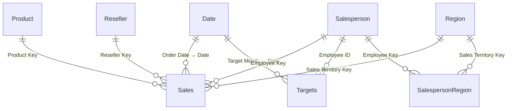

# `aw_gold` Semantic Model — Full Documentation

> **Workspace:** Fabric-PBI-Dev  
> **Item ID:** `9b1bccd5-24d6-433b-ae25-96a71345340f`  
> **Type:** Semantic Model (Power BI)  
> **Storage Mode:** Direct Lake  
> **Generated:** 2026-07-08  

---

## Table of Contents

1. [Project Context](#1-project-context)
2. [Model Properties](#2-model-properties)
3. [Architecture Overview](#3-architecture-overview)
4. [Schema Overview — Entity Relationship Diagram](#4-schema-overview--entity-relationship-diagram)
5. [Tables](#5-tables)
   - [Date](#51-date-dimension)
   - [Product](#52-product-dimension)
   - [Region](#53-region-dimension)
   - [Reseller](#54-reseller-dimension)
   - [Salesperson](#55-salesperson-dimension)
   - [Salesperson Region (Bridge)](#56-salesperson-region-bridge)
   - [Sales (Fact)](#57-sales-fact)
   - [Targets (Fact)](#58-targets-fact)
6. [Measures Catalog](#6-measures-catalog)
7. [Relationships](#7-relationships)
8. [Hierarchies](#8-hierarchies)
9. [Report Notes](#9-report-notes)

---

## 1. Project Context

The `aw_gold` semantic model is the analytical layer of the **AdventureWorks Reseller Sales** end-to-end demo project hosted in the **Fabric-PBI-Dev** workspace. The project implements an enterprise-grade, AI-assisted data engineering and BI development workflow on Microsoft Fabric.

| Attribute | Value |
|---|---|
| Scenario | AdventureWorks reseller sales analytics |
| Architecture | Medallion (Bronze → Silver → Gold) |
| Gold Layer | Star schema surfaced via Power BI semantic model |
| Authoring format | PBIP + TMDL (Git-versioned) |
| AI tooling | GitHub Copilot + Power BI Modeling MCP Server |

The raw data originates from tab-separated CSV files (Sales, Targets, Product, Reseller, Salesperson, Region, SalespersonRegion). These files land in the **Bronze** lakehouse, are cleaned and conformed through the **Silver** layer, and are shaped into the **Gold** star schema consumed by this model.

---

## 2. Model Properties

| Property | Value |
|---|---|
| Display name | `aw_gold` |
| Workspace | `Fabric-PBI-Dev` |
| Workspace ID | `f6894d78-6eeb-4014-a9ec-3e75ebe36ee8` |
| Semantic model ID | `9b1bccd5-24d6-433b-ae25-96a71345340f` |
| Culture | `en-US` |
| Source query culture | `en-US` |
| Default Power BI data source version | Power BI V3 |
| Storage mode | Direct Lake |
| Implicit measures | Discouraged (all aggregations must be explicit measures) |
| Data source | OneLake — `aw_gold` Lakehouse |
| OneLake URL | `https://onelake.dfs.fabric.microsoft.com/f6894d78-6eeb-4014-a9ec-3e75ebe36ee8/0b09704d-576a-4f87-8321-741e6d791735` |
| Tables | 8 |
| Columns | 53 |
| Measures | 11 |
| Relationships | 9 |

### Direct Lake connection

The model uses a single shared `DirectLake - aw_gold` expression referencing the `aw_gold` Lakehouse via OneLake DFS. All eight partitions bind to Delta tables in that lakehouse using `mode: directLake`, which means data is read directly from Parquet/Delta without import or query-folding to SQL.

---

## 3. Architecture Overview

```
Raw CSVs (data/)
    │
    ▼
┌─────────────────┐
│  aw_bronze      │  Bronze Lakehouse
│  Notebook:      │  01_bronze_ingest
│  Raw ingest     │
└────────┬────────┘
         │
         ▼
┌─────────────────┐
│  aw_silver      │  Silver Lakehouse
│  Notebook:      │  02_silver_transform
│  Clean & conform│
└────────┬────────┘
         │
         ▼
┌─────────────────┐
│  aw_gold        │  Gold Lakehouse
│  Notebook:      │  03_gold_star_schema
│  Star schema    │
└────────┬────────┘
         │   Direct Lake
         ▼
┌─────────────────┐
│  aw_gold        │  Semantic Model (this document)
│  Semantic Model │  Power BI / PBIP + TMDL
└─────────────────┘
```

**Gold layer Delta tables** (source entities in the Lakehouse):

| Lakehouse entity | Model table |
|---|---|
| `dim_date` | Date |
| `dim_product` | Product |
| `dim_region` | Region |
| `dim_reseller` | Reseller |
| `dim_salesperson` | Salesperson |
| `bridge_salesperson_region` | Salesperson Region |
| `fact_sales` | Sales |
| `fact_targets` | Targets |

---

## 4. Schema Overview — Entity Relationship Diagram



**Schema classification:**

| Type | Tables |
|---|---|
| Date dimension | Date |
| Fact tables | Sales, Targets |
| Standard dimensions | Product, Region, Reseller, Salesperson |
| Bridge table (M:N) | Salesperson Region |

The **Salesperson Region** bridge resolves the many-to-many relationship between salespeople and sales territories. A salesperson can cover multiple regions; a region can be covered by multiple salespeople.

---

## 5. Tables

### 5.1 Date Dimension

> Date dimension: contiguous daily calendar spanning the sales and targets date range. Marked as the model's date table.

| Property | Value |
|---|---|
| Data category | Time (marked date table) |
| Storage mode | Direct Lake |
| Source entity | `dim_date` |

#### Columns

| Column | Data Type | Visible | Format | Description |
|---|---|---|---|---|
| `Date` | Date | ✅ | General Date | Unique calendar date. Primary key; used as the join axis for all date-based relationships. |
| `Year` | Integer | ✅ | 0 | Calendar year number. |
| `Quarter` | Integer | ✅ | 0 | Calendar quarter number (1–4). |
| `Month Number` | Integer | 🔒 hidden | 0 | Month number (1–12). Used to sort Month Name chronologically. |
| `Month` | Text | ✅ | — | Full month name (e.g. January). Sorted by Month Number. |
| `Year Month` | Text | ✅ | — | Year and month in yyyy-MM format. |

---

### 5.2 Product Dimension

> Product dimension: one row per product sold by Adventure Works, including its category hierarchy and standard cost.

| Property | Value |
|---|---|
| Data category | Regular |
| Storage mode | Direct Lake |
| Source entity | `dim_product` |

#### Columns

| Column | Data Type | Visible | Source Column | Description |
|---|---|---|---|---|
| `Product Key` | Integer | 🔒 hidden | `product_key` | Surrogate key. Foreign key in the Sales fact table. |
| `Product` | Text | ✅ | `product` | Product name. |
| `Standard Cost` | Number | ✅ | `standard_cost` | List price cost basis of the product. |
| `Color` | Text | ✅ | `color` | Product color. |
| `Subcategory` | Text | ✅ | `subcategory` | Product subcategory (mid level of the product hierarchy). |
| `Category` | Text | ✅ | `category` | Product category (top level of the product hierarchy). |
| `Background Color Format` | Text | 🔒 hidden | `background_color_format` | Hex color code for visual background formatting (KPI conditional formatting). |
| `Font Color Format` | Text | 🔒 hidden | `font_color_format` | Hex color code for visual font formatting (KPI conditional formatting). |

#### Measures

| Measure | Expression | Format | Folder | Description |
|---|---|---|---|---|
| `Product Count` | `DISTINCTCOUNT('Product'[Product Key])` | `#,##0` | Counts | Number of distinct products in the filter context. |

---

### 5.3 Region Dimension

> Sales territory / region dimension: one row per sales territory, grouped into country and geographic group.

| Property | Value |
|---|---|
| Data category | Regular |
| Storage mode | Direct Lake |
| Source entity | `dim_region` |

#### Columns

| Column | Data Type | Visible | Data Category | Source Column | Description |
|---|---|---|---|---|---|
| `Sales Territory Key` | Integer | 🔒 hidden | Regular | `salesterritory_key` | Surrogate key. Foreign key in Sales and Salesperson Region. |
| `Region` | Text | ✅ | Regular | `region` | Sales territory region name. |
| `Country` | Text | ✅ | Country | `country` | Country of the sales territory. |
| `Group` | Text | ✅ | Regular | `group` | Geographic group (e.g. North America, Europe, Pacific). |

#### Measures

| Measure | Expression | Format | Folder | Description |
|---|---|---|---|---|
| `Region Count` | `DISTINCTCOUNT('Region'[Sales Territory Key])` | `#,##0` | Counts | Number of distinct sales territories in the filter context. |

---

### 5.4 Reseller Dimension

> Reseller dimension: one row per reseller (distributor) that purchases Adventure Works products, including its geography.

| Property | Value |
|---|---|
| Data category | Regular |
| Storage mode | Direct Lake |
| Source entity | `dim_reseller` |

#### Columns

| Column | Data Type | Visible | Data Category | Source Column | Description |
|---|---|---|---|---|---|
| `Reseller Key` | Integer | 🔒 hidden | Regular | `reseller_key` | Surrogate key. Foreign key in the Sales fact table. |
| `Business Type` | Text | ✅ | Regular | `business_type` | Reseller business type (e.g. Warehouse, Value Added Reseller, Specialty Bike Shop). |
| `Reseller` | Text | ✅ | Regular | `reseller` | Reseller name. |
| `City` | Text | ✅ | City | `city` | City where the reseller is located. |
| `State Province` | Text | ✅ | StateOrProvince | `state_province` | State or province where the reseller is located. |
| `Country Region` | Text | ✅ | Country | `country_region` | Country or region where the reseller is located. |

#### Measures

| Measure | Expression | Format | Folder | Description |
|---|---|---|---|---|
| `Reseller Count` | `DISTINCTCOUNT('Reseller'[Reseller Key])` | `#,##0` | Counts | Number of distinct resellers in the filter context. |

---

### 5.5 Salesperson Dimension

> Salesperson dimension: one row per salesperson (employee). Employee ID links to sales targets.

| Property | Value |
|---|---|
| Data category | Regular |
| Storage mode | Direct Lake |
| Source entity | `dim_salesperson` |

#### Columns

| Column | Data Type | Visible | Source Column | Description |
|---|---|---|---|---|
| `Employee Key` | Integer | 🔒 hidden | `employee_key` | Surrogate key. Foreign key in Sales and Salesperson Region bridge. |
| `Employee ID` | Integer | 🔒 hidden | `employee_id` | Natural (HR) employee ID. Links to the Targets fact via Employee ID. |
| `Salesperson` | Text | ✅ | `salesperson` | Salesperson full name. |
| `Title` | Text | ✅ | `title` | Salesperson job title. |
| `UPN` | Text | ✅ | `upn` | User principal name (email/login) — supports row-level security patterns. |

#### Measures

| Measure | Expression | Format | Folder | Description |
|---|---|---|---|---|
| `Salesperson Count` | `DISTINCTCOUNT('Salesperson'[Employee Key])` | `#,##0` | Counts | Number of distinct salespeople in the filter context. |

---

### 5.6 Salesperson Region (Bridge)

> Bridge table resolving the many-to-many relationship between salespeople and the sales territories they cover.

| Property | Value |
|---|---|
| Data category | Regular |
| Storage mode | Direct Lake |
| Source entity | `bridge_salesperson_region` |

#### Columns

| Column | Data Type | Visible | Source Column | Description |
|---|---|---|---|---|
| `Employee Key` | Integer | 🔒 hidden | `employee_key` | FK → Salesperson. One side of the M:N salesperson-territory relationship. |
| `Sales Territory Key` | Integer | 🔒 hidden | `salesterritory_key` | FK → Region. Other side of the M:N salesperson-territory relationship. |

> **Note:** This table has no visible columns and no measures. It exists solely to enable bi-directional filtering between Salesperson and Region through a classic Many-to-Many bridge pattern. No cross-filtering is set on the relationships — filter propagation is controlled by DAX context.

---

### 5.7 Sales (Fact)

> Sales fact: one row per reseller sales order line, with derived profit. Grain = sales order line.

| Property | Value |
|---|---|
| Data category | Regular |
| Storage mode | Direct Lake |
| Source entity | `fact_sales` |

#### Columns

| Column | Data Type | Visible | Summarize By | Source Column | Description |
|---|---|---|---|---|---|
| `Sales Order Number` | Text | ✅ | None | `sales_order_number` | Sales order number (degenerate dimension). |
| `Order Date` | Date | 🔒 hidden | None | `order_date` | Date the order was placed. FK → Date. |
| `Product Key` | Integer | 🔒 hidden | None | `product_key` | FK → Product. |
| `Reseller Key` | Integer | 🔒 hidden | None | `reseller_key` | FK → Reseller. |
| `Employee Key` | Integer | 🔒 hidden | None | `employee_key` | FK → Salesperson. |
| `Sales Territory Key` | Integer | 🔒 hidden | None | `salesterritory_key` | FK → Region. |
| `Quantity` | Integer | 🔒 hidden | Sum | `quantity` | Number of product units sold on this order line. |
| `Unit Price` | Number | 🔒 hidden | Sum | `unit_price` | List price per unit at the time of sale. |
| `Sales Amount` | Number | 🔒 hidden | Sum | `sales` | Total revenue for this order line (unit price × quantity, after adjustments). Source for `Total Sales`. |
| `Cost Amount` | Number | 🔒 hidden | Sum | `cost` | Total cost of goods sold for this order line. Source for `Total Cost`. |
| `Profit Amount` | Number | 🔒 hidden | Sum | `profit` | Gross profit for this order line (Sales Amount − Cost Amount), pre-computed in the Gold layer. Source for `Total Profit`. |

#### Measures

| Measure | Expression | Format String | Folder | Description |
|---|---|---|---|---|
| `Total Sales` | `SUM('Sales'[Sales Amount])` | `$#,##0.00;($#,##0.00)` | Sales | Total revenue from reseller sales in the filter context. |
| `Total Cost` | `SUM('Sales'[Cost Amount])` | `$#,##0.00;($#,##0.00)` | Sales | Total cost of goods sold in the filter context. |
| `Total Profit` | `SUM('Sales'[Profit Amount])` | `$#,##0.00;($#,##0.00)` | Profitability | Total gross profit in the filter context. |
| `Profit Margin %` | `DIVIDE([Total Profit], [Total Sales])` | `0.00%` | Profitability | Gross profit as a percentage of total revenue. Returns BLANK when sales is zero. |
| `Total Quantity` | `SUM('Sales'[Quantity])` | `#,##0` | Sales | Total units sold in the filter context. |
| `Order Count` | `DISTINCTCOUNT('Sales'[Sales Order Number])` | `#,##0` | Counts | Number of distinct sales orders in the filter context. |

---

### 5.8 Targets (Fact)

> Targets fact: one row per salesperson per month with the assigned sales target. Grain = salesperson + month.

| Property | Value |
|---|---|
| Data category | Regular |
| Storage mode | Direct Lake |
| Source entity | `fact_targets` |

#### Columns

| Column | Data Type | Visible | Source Column | Description |
|---|---|---|---|---|
| `Employee ID` | Integer | 🔒 hidden | `employee_id` | Natural employee ID. FK → Salesperson[Employee ID]. |
| `Target Month` | Date | 🔒 hidden | `target_month` | First day of the month for which the target is set. FK → Date[Date]. |
| `Target` | Number | 🔒 hidden | `target` | Monthly revenue target assigned to the salesperson (in USD). Source for `Total Target`. |

#### Measures

| Measure | Expression | Format String | Folder | Description |
|---|---|---|---|---|
| `Total Target` | `SUM('Targets'[Target])` | `$#,##0.00;($#,##0.00)` | Targets | Total assigned sales target in the filter context. |

---

## 6. Measures Catalog

All 11 measures organized by display folder.

### Sales

| Measure | Table | Expression | Format |
|---|---|---|---|
| `Total Sales` | Sales | `SUM('Sales'[Sales Amount])` | `$#,##0.00;($#,##0.00)` |
| `Total Cost` | Sales | `SUM('Sales'[Cost Amount])` | `$#,##0.00;($#,##0.00)` |
| `Total Quantity` | Sales | `SUM('Sales'[Quantity])` | `#,##0` |

### Profitability

| Measure | Table | Expression | Format |
|---|---|---|---|
| `Total Profit` | Sales | `SUM('Sales'[Profit Amount])` | `$#,##0.00;($#,##0.00)` |
| `Profit Margin %` | Sales | `DIVIDE([Total Profit], [Total Sales])` | `0.00%` |

### Targets

| Measure | Table | Expression | Format |
|---|---|---|---|
| `Total Target` | Targets | `SUM('Targets'[Target])` | `$#,##0.00;($#,##0.00)` |

### Counts

| Measure | Table | Expression | Format |
|---|---|---|---|
| `Order Count` | Sales | `DISTINCTCOUNT('Sales'[Sales Order Number])` | `#,##0` |
| `Product Count` | Product | `DISTINCTCOUNT('Product'[Product Key])` | `#,##0` |
| `Region Count` | Region | `DISTINCTCOUNT('Region'[Sales Territory Key])` | `#,##0` |
| `Reseller Count` | Reseller | `DISTINCTCOUNT('Reseller'[Reseller Key])` | `#,##0` |
| `Salesperson Count` | Salesperson | `DISTINCTCOUNT('Salesperson'[Employee Key])` | `#,##0` |

---

## 7. Relationships

All 9 relationships are active with one-directional cross-filtering (Many → One unless noted).

| # | Relationship | From Table | From Column | To Table | To Column | Cardinality | Active | Filter |
|---|---|---|---|---|---|---|---|---|
| 1 | `Sales_Date` | Sales | Order Date | Date | Date | Many:One | ✅ | → |
| 2 | `Sales_Product` | Sales | Product Key | Product | Product Key | Many:One | ✅ | → |
| 3 | `Sales_Reseller` | Sales | Reseller Key | Reseller | Reseller Key | Many:One | ✅ | → |
| 4 | `Sales_Salesperson` | Sales | Employee Key | Salesperson | Employee Key | Many:One | ✅ | → |
| 5 | `Sales_Region` | Sales | Sales Territory Key | Region | Sales Territory Key | Many:One | ✅ | → |
| 6 | `Targets_Date` | Targets | Target Month | Date | Date | Many:One | ✅ | → |
| 7 | `Targets_Salesperson` | Targets | Employee ID | Salesperson | Employee ID | Many:One | ✅ | → |
| 8 | `SalespersonRegion_Salesperson` | Salesperson Region | Employee Key | Salesperson | Employee Key | Many:One | ✅ | → |
| 9 | `SalespersonRegion_Region` | Salesperson Region | Sales Territory Key | Region | Sales Territory Key | Many:One | ✅ | → |

### Relationship diagram (text)

```
Date ←────────────────── Sales ──────────────────→ Product
  ↑                        │                        
  │                        ├──────────────────────→ Reseller
  │                        │
  │                        ├──────────────────────→ Salesperson ←── Salesperson Region ──→ Region
  │                        │                               ↑
  │                        └──────────────────────→ Region │
  │                                                         │
Date ←────────────────── Targets ─────────────────→ Salesperson (via Employee ID)
```

> **Many-to-Many (Salesperson ↔ Region):** The bridge table `Salesperson Region` connects Salesperson and Region without a direct relationship between them. This is an industry-standard bridge pattern — filter propagation from Salesperson to Region (or vice versa) passes through the bridge and must be managed explicitly in DAX when needed.

---

## 8. Hierarchies

Three user-defined drill-down hierarchies are defined in the model.

### Product Hierarchy (table: Product)

```
Category
  └── Subcategory
        └── Product
```

### Region Geography (table: Region)

```
Group
  └── Country
        └── Region
```

### Reseller Geography (table: Reseller)

```
Country Region
  └── State Province
        └── City
```

### Calendar (table: Date)

```
Year
  └── Quarter
        └── Month   (sorted by Month Number)
```

---

## 9. Report Notes

### Current state

As of **2026-07-08**, the `Fabric-PBI-Dev` workspace contains the `aw_gold` **semantic model only**. No Power BI Report item has been deployed to the workspace yet.

The intended report authoring workflow (Phase 3 of the demo) is:

1. Author the report in **Power BI Desktop** connected to the `aw_gold` semantic model.
2. Save as a **PBIP project** (`.pbip` + `definition/` folder with TMDL).
3. Commit the PBIP folder to the Git repository.
4. Sync to the Fabric workspace via **Git integration**.

### Recommended report structure

Based on the measures and dimensions available in the model, the following report pages are suggested:

| Page | Key visuals | Measures used |
|---|---|---|
| **Sales Overview** | KPI cards, line chart (sales over time), bar chart (by category) | Total Sales, Total Cost, Total Profit, Profit Margin % |
| **Sales by Reseller** | Map (reseller geography), table/matrix | Total Sales, Reseller Count, Order Count |
| **Sales by Salesperson** | Bar chart (salesperson ranking), target vs. actual | Total Sales, Total Target, Salesperson Count |
| **Product Analysis** | Treemap (category/subcategory), scatter plot | Total Sales, Total Quantity, Product Count, Profit Margin % |
| **Region Analysis** | Filled map (country), matrix (group → country → region) | Total Sales, Region Count |

### Key modeling decisions for report authors

| Decision | Detail |
|---|---|
| **Implicit measures discouraged** | All aggregations should use the explicit measures in the Measures Catalog (§6). Do not use auto-aggregation on numeric columns. |
| **Hidden columns** | All FK columns and raw numeric columns (Sales Amount, Cost Amount, etc.) are hidden. Use the named measures instead. |
| **Conditional formatting columns** | `Background Color Format` and `Font Color Format` on the Product table are intended for use with Power BI's conditional formatting "Field value" option — not for display in slicers or matrices. |
| **UPN column** | The `Salesperson[UPN]` column is available to implement username-based row-level security (RLS) with `USERPRINCIPALNAME()`. No RLS roles are currently defined in the model. |
| **Date table** | The `Date` table is marked as the model date table (`dataCategory: Time`). Use it as the axis for all time-intelligence visuals. |
| **Salesperson ↔ Region M:N** | Filtering from Salesperson to Region (or reverse) propagates through the bridge. For cross-filtered reports, verify the expected filter direction in DAX if results appear unexpected. |

---

*Documentation generated by querying the live semantic model via Power BI REST API (`executeQueries`, `INFO.VIEW.*` DAX functions) and the TMDL source files in `demo/FabricFolder/aw_gold.SemanticModel/`.*
